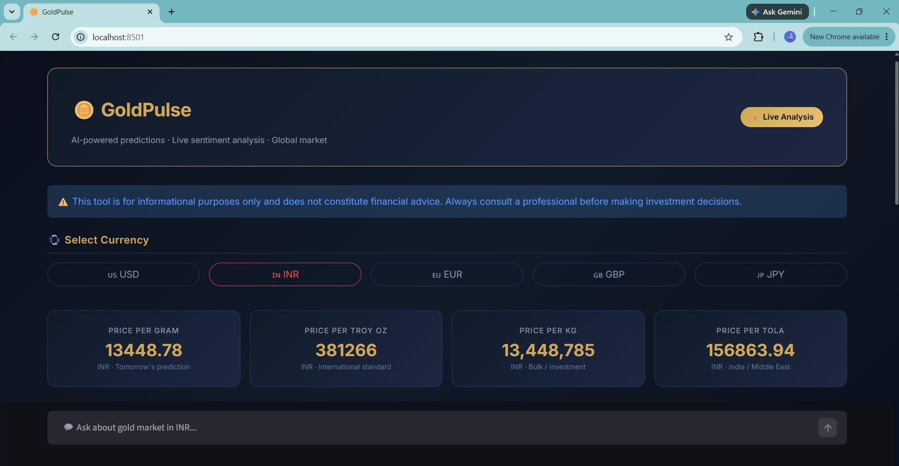
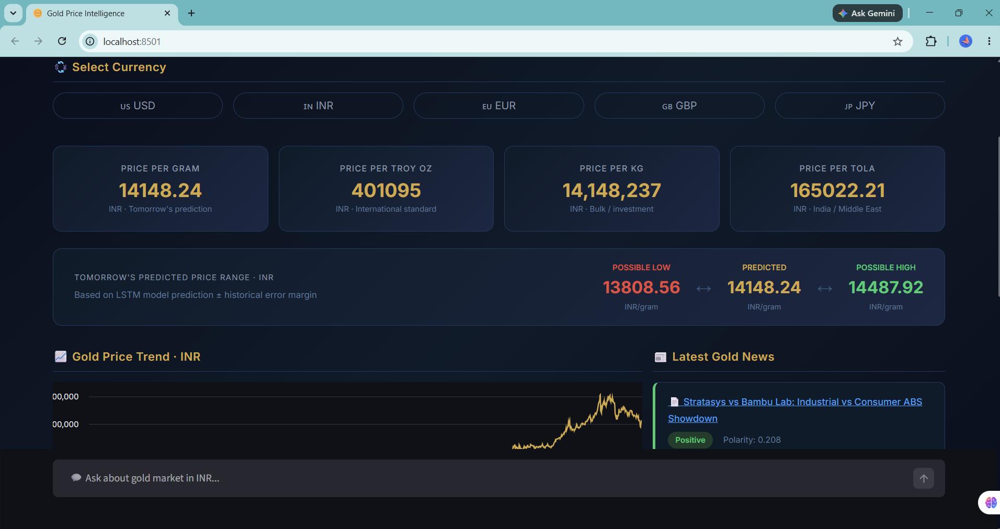
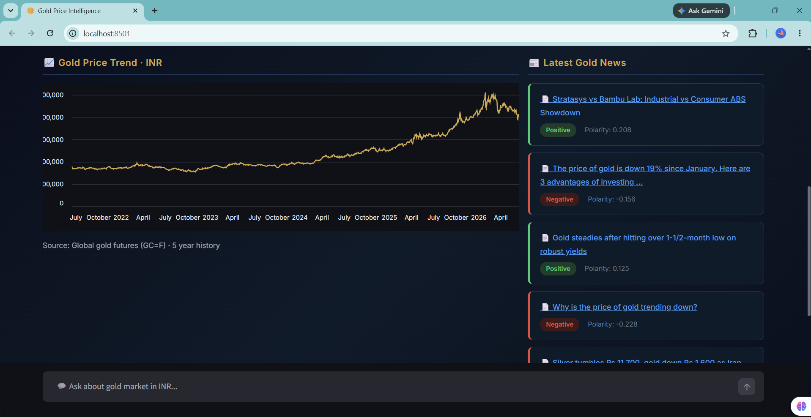
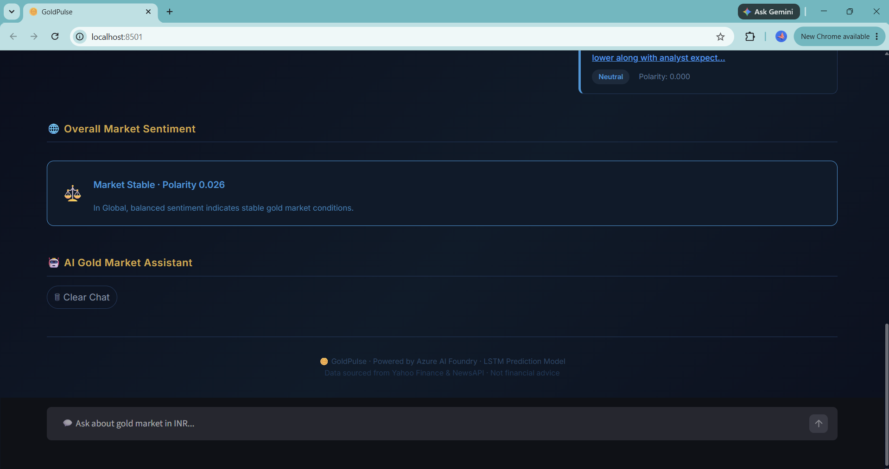

# 🪙 Gold Price Intelligence
### AI-Powered Financial Market Forecasting with LSTM & Azure AI Foundry

> An end-to-end machine learning platform for financial market forecasting — using gold as the primary use case. Built with LSTM deep learning, real-time news sentiment analysis, and an Azure AI Foundry chatbot assistant.

[](https://python.org)
[](https://streamlit.io)
[](https://tensorflow.org)
[](https://azure.microsoft.com)
[](LICENSE)

**GitHub:** [github.com/idsaturn07/gold-price-intelligence](https://github.com/idsaturn07/gold-price-intelligence)

---

## 🎯 Key Achievements

- Built an end-to-end machine learning pipeline using **TensorFlow LSTM** trained on 5 years of market data
- Automated **daily model retraining** using Azure Functions Timer Trigger with artifact upload to Azure Blob Storage
- Integrated **Azure AI Foundry Agents** with live contextual market data for intelligent Q&A
- Implemented **real-time sentiment analysis** from live financial news via NewsAPI + TextBlob
- Deployed an interactive **multi-currency analytics dashboard** using Streamlit with live FX rates
- Architected a full **MLOps pipeline** — data ingestion → training → evaluation → storage → serving

---

## 🛠️ Skills Demonstrated

- Time Series Forecasting
- Deep Learning (LSTM)
- MLOps & Model Lifecycle Management
- Cloud Deployment (Azure App Service)
- NLP & Sentiment Analysis
- Azure AI Integration (Foundry Agents)
- Data Engineering (yfinance, preprocessing, scaling)
- Financial Analytics & Multi-currency Support

---

## 📌 What It Does

- 🔮 Predicts **tomorrow's gold price** using a deep learning LSTM model trained on 5 years of data
- 📈 Shows **interactive price history chart** with live currency conversion
- 📊 Displays **price range** (Low / Predicted / High) based on model MAE error margin
- 💱 Supports **5 currencies** — USD, INR, EUR, GBP, JPY with live exchange rates
- 🌍 Filters news by **region** — Global, India, USA, UK, Japan
- 📰 Fetches **live financial news** and scores sentiment (Positive / Negative / Neutral)
- 🤖 **AI chatbot** powered by Azure AI Foundry Agents with live web search grounding
- 🔄 **Automated daily retraining** via Azure Functions Timer Trigger
- ☁️ **Model artifacts** stored and synced via Azure Blob Storage

---

## 📸 Screenshots

### Dashboard — Header, Disclaimer & Currency Selector


### Price Cards, Predicted Range & Chart


### 5-Year Price Trend & Live News Sentiment


### Overall Market Sentiment & AI Assistant


---

## 📊 Model Performance

| Metric | Value |
|---|---|
| MAE | 101.17 |
| RMSE | 135.38 |
| Training Samples | 926 |
| Training Data | 5 years of historical GC=F futures data |
| Features | Open, High, Low, Close |
| Architecture | 2-Layer LSTM + Dropout (0.3) |
| Optimizer | Adam |
| Loss Function | MSE |
| Train / Test Split | 80% / 20% |
| Next-Day Prediction | Generated dynamically after training |

> Run `python model.py` to retrain and see updated MAE / RMSE values for your own run.

---

## 🗂️ Project Structure

```
gold-price-intelligence/
│
├── app/                              # Streamlit web app
│   ├── app.py                        # Main UI — entry point
│   ├── chatbot.py                    # Azure AI Foundry Agent integration
│   ├── model.py                      # LSTM model, gold data fetch, news sentiment
│   ├── requirements.txt              # Python dependencies
│   ├── startup.sh                    # Azure App Service startup command
│   ├── .env.example                  # Environment variable template
│   └── .gitignore
│
├── retrain-function/                 # Azure Functions — daily model retraining
│   ├── function_app.py               # Timer trigger — retrains and uploads to Blob
│   ├── model.py                      # Training logic
│   ├── host.json                     # Azure Functions config
│   ├── requirements.txt              # Python dependencies
│   ├── local.settings.example.json   # Settings template
│   └── .gitignore
│
├── docs/                             # Screenshots and deployment guide
│   ├── dashboard.png
│   ├── price-cards.png
│   ├── chart-news.png
│   ├── sentiment-chatbot.png
│   └── deployment.md                 # Detailed Azure deployment steps
│
├── LICENSE
└── README.md
```

---

## 🧠 Architecture

```
                    ┌──────────────────────┐
                    │   Azure App Service   │
                    │    (Streamlit UI)     │
                    └─────────┬────────────┘
                              │
               ┌──────────────┼──────────────┐
               │              │              │
      ┌────────▼──────┐  ┌────▼───┐  ┌──────▼──────────┐
      │  LSTM Model   │  │  News  │  │  Azure AI        │
      │  (.keras file)│  │  API   │  │  Foundry Agent   │
      └────────┬──────┘  └────┬───┘  │  (gold-bot)      │
               │              │      └──────▲────────────┘
      ┌────────▼──────────────▼──────┐      │
      │      Azure Blob Storage      │      │
      │    (models container)        │      │
      └────────▲─────────────────────┘      │
               │                            │
      ┌────────┴───────────┐                │
      │   Azure Functions  │────────────────┘
      │   Timer Trigger    │  (runs daily at 1AM)
      └────────────────────┘
```

---

## ✅ Prerequisites

- [ ] Python 3.9+ → [python.org](https://python.org)
- [ ] Azure subscription → [azure.microsoft.com/free](https://azure.microsoft.com/free)
- [ ] Azure CLI → [aka.ms/installazurecli](https://aka.ms/installazurecli)
- [ ] Azure Functions Core Tools → [aka.ms/azfunc-tools](https://learn.microsoft.com/azure/azure-functions/functions-run-local)
- [ ] NewsAPI key → [newsapi.org](https://newsapi.org) (free, no card needed)
- [ ] Git → [git-scm.com](https://git-scm.com)

---

## ⚙️ Quick Start

### 1. Clone the Repository

```bash
git clone https://github.com/idsaturn07/gold-price-intelligence.git
cd gold-price-intelligence
```

### 2. Install Dependencies

```bash
cd app
pip install -r requirements.txt
```

### 3. Configure Environment

```bash
cp .env.example .env
```

Open `.env` and fill in your values:

```env
AZURE_PROJECT_ENDPOINT=https://your-resource.services.ai.azure.com/api/projects/your-project
AZURE_OPENAI_ENDPOINT=https://your-resource.services.ai.azure.com/openai/v1
AZURE_OPENAI_KEY=your_azure_openai_key_here
AZURE_DEPLOYMENT_NAME=your_deployment_name
AZURE_AGENT_NAME=gold-bot
AZURE_AGENT_VERSION=2
NEWS_API_KEY=your_newsapi_key_here
```

### 4. Train the Model

```bash
python model.py
```

Downloads 5 years of gold futures data and trains the LSTM (~5–15 min). Saves model artifacts locally.

### 5. Run the App

```bash
streamlit run app.py
```

Open [http://localhost:8501](http://localhost:8501)

> For full Azure resource setup and cloud deployment instructions, see [docs/deployment.md](docs/deployment.md)

---

## 🔐 Environment Variables

### `app/.env.example`

| Variable | Where to Find It |
|---|---|
| `AZURE_PROJECT_ENDPOINT` | AI Foundry → Project → Settings |
| `AZURE_OPENAI_ENDPOINT` | AI Foundry → Project → Settings |
| `AZURE_OPENAI_KEY` | AI Foundry → Project → Keys |
| `AZURE_DEPLOYMENT_NAME` | AI Foundry → Deployments |
| `AZURE_AGENT_NAME` | The agent you created (`gold-bot`) |
| `AZURE_AGENT_VERSION` | Agent version in Foundry |
| `NEWS_API_KEY` | newsapi.org → Account |

### `retrain-function/local.settings.example.json`

| Variable | Where to Find It |
|---|---|
| `AzureWebJobsStorage` | Storage Account → Access Keys → Connection string |
| `BLOB_CONNECTION_STRING` | Storage Account → Access Keys → Connection string |
| `NEWS_API_KEY` | newsapi.org → Account |

---

## 📦 Tech Stack

| Layer | Technology |
|---|---|
| Frontend | Streamlit |
| ML Model | TensorFlow / Keras — 2-Layer LSTM |
| Market Data | yfinance (Yahoo Finance GC=F futures) |
| News & Sentiment | NewsAPI + TextBlob |
| AI Chatbot | Azure AI Foundry Agents (web search grounded) |
| Currency Rates | exchangerate-api.com (live, 1hr cache) |
| MLOps / Automation | Azure Functions Timer Trigger |
| Model Storage | Azure Blob Storage |
| Hosting | Azure App Service |

---

## 🚧 Future Enhancements

- [ ] Transformer-based forecasting models (replacing LSTM)
- [ ] Model versioning with MLflow
- [ ] Real-time WebSocket market data feeds
- [ ] Multi-asset forecasting — Silver, Crude Oil, Stocks
- [ ] CI/CD deployment pipeline with GitHub Actions
- [ ] Backtesting framework for model evaluation over historical periods

---

## ❓ Troubleshooting

**"No trained model found" on startup**
→ Run `python model.py` inside the `app/` folder first

**Chatbot returns "AI Assistant Error"**
→ Check `AZURE_PROJECT_ENDPOINT` and `AZURE_OPENAI_KEY` in `.env`
→ Ensure `gold-bot` agent exists in your Foundry project

**News shows "No news available"**
→ Verify `NEWS_API_KEY` at newsapi.org — free tier has rate limits

**Currency values look wrong**
→ Live rates fetch from exchangerate-api.com — falls back to hardcoded rates if API is down

**Azure Function not uploading models**
→ Check `BLOB_CONNECTION_STRING` in Function App Configuration
→ Confirm the `models` container exists in your Storage Account
→ Check logs: Azure Portal → Function App → Functions → Monitor

---

## ⚠️ Disclaimer

This application is for **informational and educational purposes only**. Predictions are generated by a machine learning model trained on historical data and do not account for real-world events, geopolitical factors, or market anomalies. This is **not financial advice**. Always consult a qualified financial advisor before making investment decisions.

---

## 📄 License

MIT License — see [LICENSE](LICENSE) for details.
